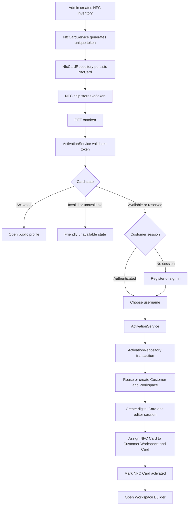

# NFC Activation Architecture

Status: canonical
Updated: 2026-07-23

## Scope

This document maps the physical NFC activation system only. Digital Access Code verification, order approval, manual subscription activation, and historical Prisma migrations are separate systems and are not NFC activation entry points.

## Dependency map

| Entry point or component | Dependency chain | Classification |
| --- | --- | --- |
| Admin NFC Cards `/admin/cards` | `generateNfcCardsAction` -> `NfcCardService.create` -> `NfcCardRepository.createCards` -> `NfcCard.createMany` | Current: inventory provisioning |
| Admin card drawer activation URL | `NfcCardService.activationUrl` -> `buildActivationUrl` -> `buildActivationPath` | Current: canonical `/a/{token}` generator |
| Admin Activation Center `/admin/subscription-activations` | `NfcCardService.listForExport/summary` -> `NfcCardRepository` | Current: operational read-only view |
| NFC chip or activation link `/a/[token]` | route page -> `ActivationService.validate` -> `ActivationRepository.findCardByActivationToken` | Current: only token resolver |
| Manual token entry `/activate` | GET form -> `buildActivationPath` -> redirect to `/a/[token]` | Current: optional fallback only |
| Unauthenticated activation UI | `ActivationExperience` -> `registerAndActivateAction` or `loginAndActivateAction` | Current |
| Authenticated activation UI | `ActivationExperience` -> `continueActivationAction` | Current |
| Activation actions | `getActivationService` -> `ActivationService` | Current: cookie and rate-limit boundary |
| Activation transaction | `ActivationService.registerAndActivate/loginAndActivate/activateAuthenticated` -> `ActivationRepository.activateByToken` | Current: only mutation path |
| Public profile after an activated NFC tap | `/a/[token]` -> `buildProfileUrl` -> `/@username` | Current |
| Workspace Builder after activation | editor session stored client-side -> `/workspace?slug={slug}` | Current: direct handoff |
| Customer login/register pages | customer-auth actions -> authentication methods on `ActivationService` | Shared authentication, not an NFC entry point |
| Digital Access Code `/access` | Access Code service/use cases and EditorSession | Separate digital-card access flow |
| Admin subscription activation | subscription actions/use cases | Separate billing lifecycle |
| Order approval activation wording | order use cases and Access Code issuance | Separate digital-order flow |
| Superseded Activation/HMAC/batch migrations | historical files under `prisma/migrations` | Migration history only; never runtime dependencies |

## Removed legacy dependencies

- `/activate/[token]`: duplicate route alias that re-exported `/a/[token]`.
- `NfcCardService.resolve`: runtime-unused second token validation and lookup path.
- `NfcCardRepository.findByActivationToken`: duplicate public resolver used only by the removed service method.
- Direct Workspace links to `/activate/{token}`.
- The conditional post-activation redirect that sent additional cards to the Workspace index instead of the activated card builder.
- Route-owned activation UI files under `src/app/activate`; canonical activation UI now belongs to `src/features/activation`.

## Canonical flow

## Transaction guarantees

`ActivationRepository.activateByToken` is the only activation mutation. Its transaction:

1. Finds an AVAILABLE or RESERVED unowned NFC card.
2. Claims the card using a guarded conditional update.
3. Reuses the authenticated Customer, Workspace, and OWNER membership, or creates them during registration.
4. Creates the digital Card, profile, sections, Access Code, EditorSession, and CustomerSession.
5. Assigns the NFC card to the Customer, Workspace, and digital Card.
6. Sets `status=ACTIVATED` and `activatedAt`.
7. Rolls back every change if any step fails.

## Token rules

- Tokens are eight-character uppercase values from the unambiguous 32-character alphabet.
- `NfcCard.activationToken` is unique and immutable.
- `activationTokenSchema` is the only public token normalization and validation contract.
- `ActivationRepository.findCardByActivationToken` is the only runtime public lookup.
- The permanent NFC URL is always `/a/{token}`.
- Activation capability is consumed by the atomic lifecycle transition; the permanent token remains the public-profile resolver after activation.
