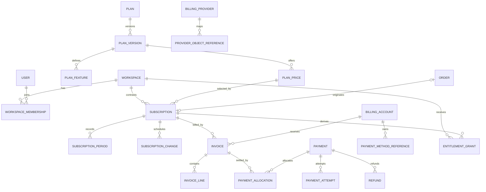
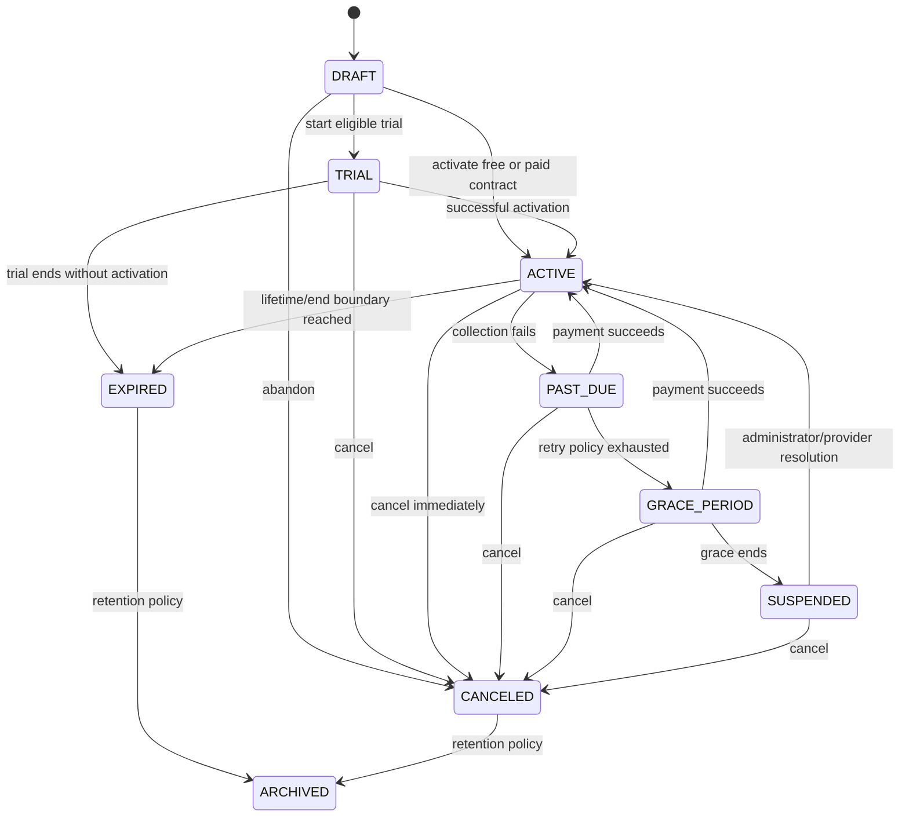

# Subscription Architecture Foundation

**Status:** Target architecture; no runtime implementation or schema migration  
**Scope:** Catalog, subscriptions, billing boundaries, access, events, and provider extension points  
**Out of scope:** Checkout, gateway integrations, invoicing implementation, renewals, proration, and production-data migration

## Architectural principles

1. A Plan describes capabilities; a Price describes money and cadence.
2. A Subscription is a contractual lifecycle owned by one Workspace, not a payment record.
3. Orders capture acquisition intent. They do not represent renewals or the billing ledger.
4. Invoices state what is owed. Payments state money movement. Payment attempts state provider interaction.
5. Entitlements are derived from the subscription and price/plan snapshots, then consumed by access checks.
6. Provider identifiers stay behind billing ports and never become domain identity.
7. All monetary values use integer minor units and ISO 4217 currency codes.
8. State transitions are explicit, idempotent, audited, and transactionally paired with an outbox event.
9. Historical commercial terms are immutable snapshots. Editing a Plan affects future sales only.
10. Access policy fails closed when entitlement state cannot be established.

## Current-system findings

- `Plan` mixes catalog identity, mutable feature configuration, and monthly/quarterly/yearly prices.
- `Subscription` belongs to `Customer`; future teams and multiple Workspaces require Workspace ownership.
- `Workspace` is currently one-to-one with Customer and has no membership model.
- `SubscriptionStatus` lacks Draft, Grace Period, Suspended, and Archived as explicit domain states; `PAUSED` is ambiguous.
- `CreateOrderSubscription` activates a subscription immediately from an Order path, coupling fulfillment to billing state.
- `ManageSubscription` contains lifecycle, renewal, extension, and plan-change behavior in one use case before billing policies exist.
- `Order` correctly snapshots commercial fields for acquisition, but it must not become the renewal ledger.
- `Invoice` requires an Order and cannot independently represent a recurring billing period.
- `PaymentSubmission` is correctly shaped for manual proof review, but it is not a universal Payment or gateway attempt.
- `provider` and `providerRef` on Subscription are insufficient for multiple providers, migrations, retries, and webhook idempotency.
- Access is inferred through Customer → Card and active-like statuses rather than a dedicated entitlement boundary.
- Admin roles exist; Workspace Owner/Admin/Member/Viewer roles and scoped permissions do not.

## Bounded contexts and responsibilities

| Context | Owns | Must not own |
| --- | --- | --- |
| Catalog | Plans, plan versions, prices, features, limits | Customer state, payments, renewal dates |
| Subscription | Contract lifecycle, selected price, periods, cancellation intent, trial | Gateway SDKs, invoice rendering, page authorization |
| Billing | Billing periods, invoices, adjustments, credits, totals | Provider transport, workspace permissions |
| Payments | Attempts, transactions, refunds, provider references, webhook inbox | Subscription transition policy, feature access |
| Ordering | Initial purchase intent and fulfillment | Recurring periods, renewals, entitlement truth |
| Access | Entitlements and workspace-scoped policy decisions | Price calculation, payment capture |
| Identity | Platform admins, workspace memberships, roles | Subscription status mutation |
| Workspace | Tenant resources and ownership | Billing ledger and gateway state |

## Target entity model



### Catalog

- **Plan:** Stable product identity (`key`, display name, lifecycle). It is never a price.
- **PlanVersion:** Immutable capabilities/limits published together. Existing subscriptions retain their version.
- **PlanPrice:** Immutable currency, amount, cadence (`FREE`, `MONTH`, `YEAR`, future `LIFETIME`), interval count, trial eligibility, and effective window.
- **PlanFeature:** Typed feature key and optional limit belonging to a PlanVersion.
- **Coupon/Promotion (future):** Eligibility and redemption policy. It produces an adjustment; it never mutates PlanPrice.

Free plans use a zero-valued `PlanPrice` with cadence `FREE`. Trials are a Subscription phase with explicit trial dates, not a separate Plan. Lifetime uses a one-time price and a non-renewing Subscription contract.

### Subscription

- **Subscription:** Workspace-owned contract, selected immutable PlanPrice, lifecycle status, period boundaries, trial boundaries, cancellation policy, version for optimistic concurrency, and archival timestamp.
- **SubscriptionPeriod:** Immutable record of each service period and its origin (trial, paid, complimentary, lifetime).
- **SubscriptionChange:** Scheduled upgrade, downgrade, cadence change, cancellation, or reactivation with effective date and policy snapshot.
- **SubscriptionAdjustment (future):** Domain result of proration or credit calculation, later represented as invoice lines.

Only one service-granting Subscription may be current for a Workspace at a time. Historical subscriptions remain queryable and immutable except for archival metadata.

### Billing, invoices, and payments

- **BillingAccount:** Legal payer identity, contact, tax profile, locale, and default currency. It may serve multiple Workspaces later.
- **Invoice:** Subscription/billing-account document for a period. Order is optional provenance, not required ownership.
- **InvoiceLine:** Immutable description, quantity, unit amount, adjustment/tax classification, and commercial snapshots.
- **Payment:** Canonical money movement intent and aggregate status; independent of provider.
- **PaymentAttempt:** One provider call or manual review attempt, including idempotency key and safe failure classification.
- **PaymentAllocation:** Many-to-many allocation between Payments and Invoices, enabling partial or combined settlement.
- **Refund:** Money returned against a settled Payment.
- **PaymentSubmission:** Retained as the manual-payment evidence/review subtype; approval creates or settles a canonical Payment in a future implementation.
- **ProviderObjectReference:** Maps internal aggregate IDs to provider object types/IDs without polluting domain identity.
- **WebhookInbox:** Deduplicated raw-provider envelope metadata and processing state. Sensitive payload handling follows provider policy.
- **OutboxEvent:** Transactional domain-event publication record.

### Orders

Order remains the acquisition and fulfillment aggregate. It may originate the first Subscription and Invoice. Renewals, plan changes, prorations, and recurring invoices never create Orders. Order snapshots remain historical evidence and do not drive ongoing entitlement decisions.

### Workspace, identity, and access

- Workspace is the tenant and entitlement owner.
- User is a human identity independent of Customer billing/contact identity.
- WorkspaceMembership joins User to Workspace with one Workspace role.
- EntitlementGrant is the normalized, time-bounded capability/limit projection derived from a Subscription or an explicit administrative grant.
- AccessPolicy evaluates actor membership plus current entitlement; it never reads payment-provider state directly.

## Recommended schema changes for a future migration sprint

No schema change is made by this document.

### Additive first phase

- Add `PlanVersion`, `PlanPrice`, `WorkspaceMembership`, `BillingAccount`, `SubscriptionPeriod`, `SubscriptionChange`, `InvoiceLine`, `Payment`, `PaymentAttempt`, `PaymentAllocation`, `Refund`, `ProviderObjectReference`, `WebhookInbox`, `OutboxEvent`, and `EntitlementGrant`.
- Add nullable `workspaceId`, `planPriceId`, `billingAccountId`, `originOrderId`, `trialStart`, `trialEnd`, `cancelAtPeriodEnd`, `endedAt`, `archivedAt`, and integer `version` to Subscription.
- Add nullable `subscriptionId`, `billingAccountId`, `periodStart`, `periodEnd`, `dueAt`, and `paidAt` to Invoice; make Order optional only after backfill and validation.
- Keep existing columns during compatibility reads. Do not rewrite production data in the additive migration.

### Constraints

- Partial unique index: one service-granting Subscription per Workspace for statuses `TRIAL`, `ACTIVE`, `PAST_DUE`, `GRACE_PERIOD`, or `SUSPENDED`.
- Unique `(planVersionId, currency, cadence, intervalCount, effectiveFrom)` for PlanPrice.
- Unique `(workspaceId, userId)` for WorkspaceMembership.
- Unique `(provider, providerObjectType, externalId)` and `(provider, internalType, internalId, providerObjectType)` for provider mappings.
- Unique `(provider, providerEventId)` for WebhookInbox.
- Unique `idempotencyKey` for PaymentAttempt and OutboxEvent.
- Unique `(subscriptionId, periodStart, periodEnd)` for SubscriptionPeriod.
- Check constraints: non-negative money, uppercase three-character currency, coherent trial/period dates, and positive interval counts.
- Use `Restrict` for financial and contract provenance; archive rather than cascade-delete Plans, Subscriptions, Invoices, Payments, and provider mappings.

### Indexes

- Subscription: `(workspaceId, status)`, `(status, currentPeriodEnd)`, `(planPriceId, status)`, `(cancelAtPeriodEnd, currentPeriodEnd)`.
- Invoice: `(billingAccountId, status, dueAt)`, `(subscriptionId, periodStart)`, `(status, dueAt)`.
- Payment/attempt: `(status, createdAt)`, `(paymentId, createdAt)`, `(provider, status, nextRetryAt)`.
- Membership: `(userId, role)`, `(workspaceId, role)`.
- Entitlement: `(workspaceId, key, startsAt, endsAt)`.
- Outbox/webhook: `(status, availableAt)` and `(aggregateType, aggregateId, occurredAt)`.

### Circular-dependency avoidance

- Order may point to the Subscription it originated, or Subscription may carry `originOrderId`; choose one canonical direction, recommended `Subscription.originOrderId`.
- Invoice belongs to Subscription/BillingAccount and may optionally reference Order provenance.
- Payment never owns Subscription; it allocates to Invoice.
- Workspace never stores `subscriptionId`; Subscription owns `workspaceId`.
- Entitlements reference their source aggregate generically or by Subscription, but Subscription does not reference entitlement rows.

## Repository boundaries

### Write repositories

- `PlanCatalogRepository`: publish/archive PlanVersion and PlanPrice; no subscription writes.
- `SubscriptionRepository`: load-for-update, compare-and-set transition, periods, scheduled changes.
- `InvoiceRepository`: create immutable invoice/lines and controlled status transitions.
- `PaymentRepository`: payment aggregate, attempts, allocations, refunds, provider mappings.
- `MembershipRepository`: workspace-scoped membership writes.
- `EntitlementRepository`: replace/project grants transactionally.
- `OutboxRepository` and `WebhookInboxRepository`: idempotent event persistence.

Write methods accept domain commands/value objects, not Prisma unchecked inputs. Repositories persist state; they do not calculate prices, transitions, proration, permissions, or provider behavior.

### Read repositories

Create query-specific projections independent of write aggregates:

- `SubscriptionAdminReadRepository`
- `WorkspaceAccessReadRepository`
- `CustomerBillingReadRepository`
- `RevenueReportingReadRepository`
- `RenewalOperationsReadRepository`

Read models may join aggressively with explicit `select` projections. They must not be reused as mutation aggregates.

### Domain services and policies

- `SubscriptionTransitionPolicy`
- `PricingPolicy`
- `ProrationPolicy` (future)
- `TrialEligibilityPolicy`
- `RenewalPolicy` (future)
- `EntitlementPolicy`
- `WorkspaceAuthorizationPolicy`

Application services orchestrate these policies, repositories, provider ports, clock, unit of work, audit writer, and outbox. Pages and Server Actions call application use cases only.

## Subscription lifecycle

Canonical statuses use `CANCELED` consistently with existing code spelling.



### Status semantics

| Status | Service access | Meaning |
| --- | --- | --- |
| Draft | No | Contract prepared but not started |
| Trial | Yes | Time-limited trial entitlement |
| Active | Yes | Current free, paid, complimentary, or lifetime contract |
| Past Due | Yes, policy-limited | Payment failed; retries ongoing |
| Grace Period | Yes, policy-limited | Retries exhausted; final recovery window |
| Suspended | No write access | Contract retained but service restricted |
| Canceled | No | Cancellation is effective; scheduled cancellation remains Active with `cancelAtPeriodEnd` until the boundary |
| Expired | No | Service period ended |
| Archived | No | Terminal retention state; excluded from operational queries |

Every command declares expected version/status. Concurrent or duplicate transitions return the already-applied result when the idempotency key matches, otherwise a conflict. Time-based transitions are commands driven by a scheduler; reads never mutate state.

## Event model

Domain events are immutable facts in past tense and contain event ID, aggregate ID/version, occurred time, correlation/causation IDs, actor, and minimal versioned payload.

| Event | Primary consumers |
| --- | --- |
| `SubscriptionCreated` | Audit, entitlement projector |
| `SubscriptionTrialStarted` | Entitlements, future notifications |
| `SubscriptionActivated` | Entitlements, workspace unlock |
| `SubscriptionRenewed` | Entitlements, invoice/read projections |
| `SubscriptionCancellationScheduled` | Operations read model |
| `SubscriptionCanceled` | Entitlements, audit |
| `SubscriptionExpired` | Entitlements, workspace lock |
| `SubscriptionSuspended` | Entitlements, workspace lock |
| `SubscriptionPlanChanged` | Entitlements, audit, future proration |
| `PaymentAttemptFailed` | Retry policy, operations |
| `PaymentSucceeded` | Invoice allocation, subscription command |
| `InvoiceIssued` / `InvoicePaid` | Billing projections, future notifications |
| `WorkspaceLocked` / `WorkspaceUnlocked` | Audit and operational projections |

Events are stored in the Outbox in the same transaction as aggregate state. Consumers are idempotent. Provider webhooks first enter WebhookInbox, then translate into internal commands/events; provider payloads never directly mutate Subscription.

## Authorization model

### Platform roles

- **Platform Admin:** Catalog, subscriptions, billing operations, workspace support, audit; destructive financial actions require explicit permissions.
- Existing Admin role keys remain authentication concerns. Introduce granular permissions such as `BILLING_READ`, `PAYMENT_MANAGE`, `REFUND_MANAGE`, and `WORKSPACE_ACCESS_OVERRIDE` only in a future authorization sprint.

### Workspace roles

| Role | Membership | Workspace content | Members | Billing |
| --- | --- | --- | --- | --- |
| Owner | Full | Full | Manage all; transfer ownership | Manage subscription and billing account |
| Admin | Full | Full | Invite/remove Member and Viewer | Read subscription; no payment/refund by default |
| Member | Full | Create/edit allowed resources | None | None |
| Viewer | Read-only | Read-only | None | None |

Rules:

- Exactly one active Owner per Workspace; ownership transfer is transactional.
- Platform Admin is not an implicit Workspace member. Support access uses a separately audited override capability.
- Authentication establishes identity; membership establishes workspace role; entitlement establishes product capability.
- A request is authorized only when all three required checks pass.
- Billing contact/customer identity does not grant workspace access by itself.

## Billing-provider extension ports

```ts
interface BillingProvider {
  readonly key: "STRIPE" | "LEMON_SQUEEZY" | "PADDLE" | "PAYMOB" | "MANUAL";
  createPaymentAttempt(command: ProviderPaymentCommand): Promise<ProviderAttemptResult>;
  queryPayment(reference: ProviderReference): Promise<ProviderPaymentState>;
  refund(command: ProviderRefundCommand): Promise<ProviderRefundResult>;
  verifyWebhook(request: ProviderWebhookRequest): Promise<VerifiedProviderEvent>;
}
```

Provider adapters translate provider states into canonical results. They do not call repositories or transition Subscriptions. Provider configuration/secrets remain environment-owned. Capability flags declare whether an adapter supports hosted checkout, recurring mandates, refunds, partial refunds, webhooks, or customer portals; application use cases reject unsupported operations explicitly.

Manual Payments implement the same boundary through submission/review rather than a remote API. No adapter is selected inside domain entities; application configuration resolves adapters by provider key.

## Implementation roadmap

1. **Contract lock:** Approve terminology, Workspace ownership, state semantics, and event versions.
2. **Additive schema:** Add catalog versions/prices, memberships, billing/payment ledger, outbox/inbox, and nullable compatibility links. No backfill mutation in this step.
3. **Compatibility repositories:** Introduce focused read/write contracts and map current Plan/Subscription data without changing UI behavior.
4. **Workspace ownership:** Backfill Workspace membership and Subscription workspace links with reconciliation reports and rollback plan.
5. **Entitlement projection:** Build fail-closed access read model; run in shadow mode against existing access decisions.
6. **Lifecycle engine:** Implement commands, optimistic concurrency, outbox, and scheduled transitions behind tests; do not connect billing yet.
7. **Billing ledger:** Add InvoiceLine, Payment, attempts, allocations, manual-payment adapter, and reconciliation.
8. **Provider adapters:** Integrate one provider at a time behind contract tests and webhook idempotency.
9. **Commercial changes:** Add trials, coupons, upgrades/downgrades, prorations, and renewals as separate policy-led sprints.
10. **Legacy retirement:** Remove compatibility columns and broad platform repository methods only after parity, audit, and production backfill verification.

## Architecture acceptance criteria

- No page, component, route, or provider adapter decides subscription transitions.
- Workspace is the access/entitlement boundary; BillingAccount is the payer boundary.
- Plan changes never rewrite historical contract or invoice terms.
- Orders are absent from renewal and recurring billing flows.
- Every provider event and payment attempt is idempotent and auditable.
- Financial records are archived/reversed, never destructively deleted.
- Missing optional relations do not invalidate financial history.
- Read models and write aggregates have separate repository contracts.
- All lifecycle transitions and access consequences have deterministic tests before implementation.
